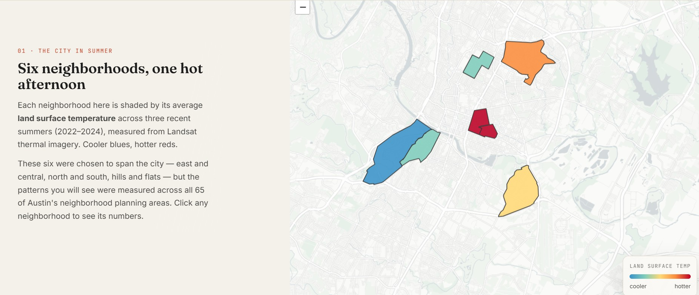

# The Heat Beneath the City — Austin Urban Heat Island Analysis

An interactive scrollytelling web map of summer land surface temperature across
Austin, Texas, and its relationship to tree canopy, impervious surface, and
household income. Built on measured satellite and census data across all 65 of
the city's neighborhood planning areas.

**Live demo:** https://nirajan550123.github.io/projects/austin-heat-storymap/
**Methodology:** https://nirajan550123.github.io/projects/austin-heat-storymap/methodology.html



## Overview

As the reader scrolls, a sticky Leaflet map recolors the neighborhoods through
four variables — land surface temperature, tree canopy, impervious surface, and
median income — while the narrative moves from where Austin runs hottest, to why
(canopy and pavement), to who the heat falls on (income), to what can be done.
Statistical scatter plots appear alongside the relevant sections.

The analysis is built from measured data:

| Variable | Source | Processing |
|----------|--------|------------|
| Land surface temperature | Landsat 8/9 C2 L2 thermal band | Median of clear-sky summer scenes (Jun–Aug 2022–2024), Google Earth Engine |
| Tree canopy | NLCD / USFS Tree Canopy Cover | Zonal mean per neighborhood |
| Impervious surface | NLCD impervious layer | Zonal mean per neighborhood |
| Median income | U.S. Census ACS 2018–2022 (B19013) | Area-weighted from tracts to neighborhoods in PostGIS |
| Boundaries | City of Austin Neighborhood Planning Areas | Dissolved by name to 65 areas |

## Key findings

Across all 65 neighborhoods (Pearson correlation against land surface temperature):

- **Tree canopy:** r = −0.87 (strong negative)
- **Impervious surface:** r = +0.83 (strong positive)
- **Median income:** r = −0.51 (moderate negative)

Heat tracks the physical landscape — canopy and pavement — far more tightly than
it tracks income.

## Pipeline

```
01_create_boundary_asset.js   GEE: build neighborhood asset, dissolve to 65
02_heat_analysis.js           GEE: LST composite, NLCD zonal stats, correlations, CSV export
03_census_income.R            R:  pull ACS tract income -> PostGIS
04_neighborhoods_to_postgis.R R:  dissolve neighborhoods -> PostGIS
05_income_spatial_join.sql    PostGIS: SRID transform + area-weighted income join
index.html                    Leaflet + Chart.js scrollytelling map
methodology.html              Full methodology write-up
```

Stages run in order. Earth Engine produces the temperature, canopy, and
impervious statistics; R and PostGIS produce the income values; the results are
merged into `austin_heat.geojson`, which the web map reads.

## Built with

- **Google Earth Engine** (JavaScript API) — satellite compositing and zonal statistics
- **PostgreSQL + PostGIS** — spatial database and the area-weighted income join
- **R** (`tidycensus`, `sf`, `RPostgres`) — census data retrieval and loading
- **Leaflet** — the interactive map
- **Chart.js** — the statistical scatter plots
- Vanilla JavaScript, GeoJSON, CARTO basemap tiles

## Running it

The web map (`index.html` + `austin_heat.geojson` + `methodology.html`) is static;
open `index.html` or serve the folder.

To reproduce the data pipeline:

1. Run `01` and `02` in the Google Earth Engine Code Editor; export the stats CSV.
2. Install PostgreSQL + PostGIS; create the `austin_heat` database with the
   PostGIS extension.
3. Set your database password as an environment variable (`PGPASSWORD`) and your
   Census API key in the R script. Run `03` and `04` to load PostGIS, then `05`
   for the spatial join.
4. Merge the Earth Engine stats and the income CSV into `austin_heat.geojson`.

Credentials (database password, API key) are read from environment variables and
are not stored in the code.

## Skills demonstrated

Remote sensing and Google Earth Engine (Landsat LST compositing, NLCD zonal
statistics) · spatial SQL in PostGIS (coordinate reprojection, area-weighted
spatial join) · census data retrieval and integration in R · interactive web
mapping and data visualization (Leaflet, Chart.js) · scrollytelling for a general
audience.

## Author

**Nirajan Tripathi** — M.S. Geography, Texas State University
[Portfolio](https://nirajan550123.github.io/) ·
[LinkedIn](https://www.linkedin.com/in/nirajan-tripathi-5434a8308/) ·
[GitHub](https://github.com/nirajan550123)
