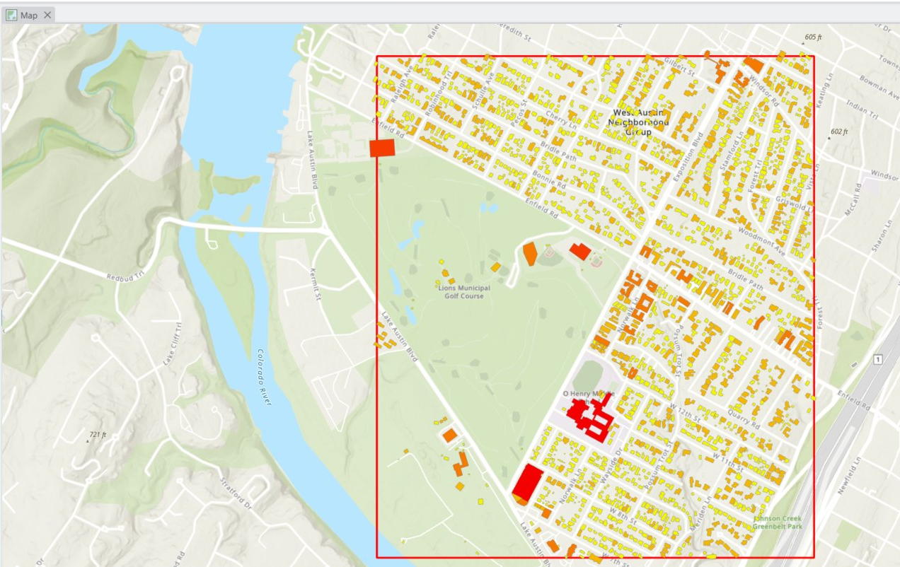
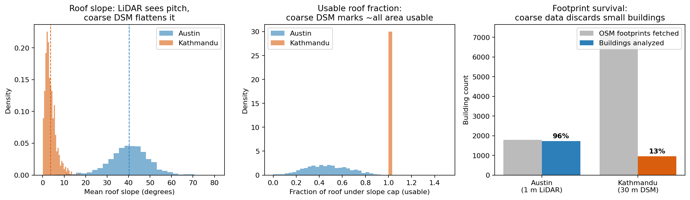
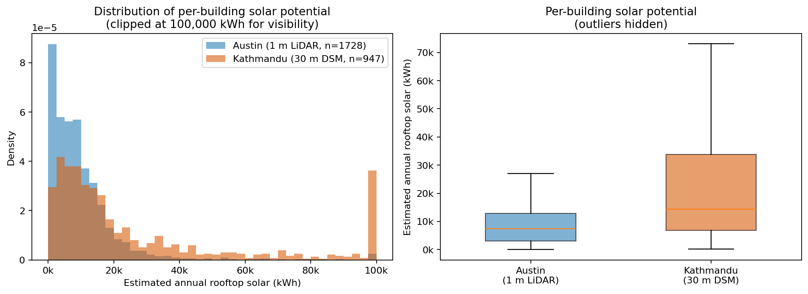

# Rooftop Solar Potential Across Data Environments — LiDAR vs. Open DSM (Austin, TX & Kathmandu, Nepal)

A **building-level rooftop-solar estimation** that runs **one identical method** on two
very different elevation datasets — 1 m airborne **LiDAR** (Austin) and a 30 m **open
global DSM** (Kathmandu) — to quantify how *data resolution itself* systematically
biases a solar estimate. The finding is not which city gets more sun, but **how much a
coarse elevation source distorts the result, and in which direction.**

## Problem
Most rooftop-solar workflows use high-quality LiDAR over a US city and stop there. But
in most of the world — including Nepal — open LiDAR does not exist. This project turns
that data gap into the experiment: run the same pipeline where LiDAR exists and where it
does not, then measure exactly what is gained and lost. The practical stakes: energy
planners in data-scarce regions who trust coarse DSMs naively will **over-estimate**
rooftop potential.

## Study areas
| Area | Elevation source | Resolution |
|---|---|---|
| West Austin Neighborhood Group, TX | USGS 3DEP airborne LiDAR (TX Central B1 2017) | 1 m |
| Central Kathmandu, Nepal | Copernicus GLO-30 open global DSM | 30 m |

## Data
| Dataset | Source |
|---|---|
| Airborne LiDAR point cloud (24.6 M points) | USGS 3DEP LidarExplorer |
| Open global DSM (Kathmandu) | Copernicus GLO-30, via OpenTopography |
| Building footprints | OpenStreetMap (osmnx) |
| Irradiation (GHI) | Global Solar Atlas *(placeholder values — see Limitations)* |

## Method
1. **Austin (ArcGIS Pro):** raw LiDAR → LAS dataset → 1 m **DSM** (first returns, max) and
   **DTM** (ground-filtered, min); CRS verified (EPSG 6343, metres, NAVD88).
2. **Kathmandu (Python):** download Copernicus GLO-30 DSM, reproject to UTM 45N
   (EPSG 32645) with `rasterio.warp`.
3. **Slope & aspect (Python):** derived from the DSM with the **Horn (1981) 3×3 gradient**
   (NumPy, vectorised) — identical to the ArcGIS algorithm.
4. **Per-building zonal aggregation (Python):** OSM footprints rasterised with
   `rasterio.features.geometry_mask`; usable-roof fraction and equator-facing aspect
   score computed per building.
5. **Energy model:** `annual_kWh = usable_area × GHI × aspect_score × panel_efficiency ×
   performance_ratio` — every term explicit. **One shared module runs both cities.**

## Results
The coarse DSM does not just add noise — it adds **directional bias**, confirmed
statistically (Mann–Whitney U p ≈ 10⁻⁶⁸; Kolmogorov–Smirnov D = 0.31).

| Metric | Austin · 1 m LiDAR | Kathmandu · 30 m DSM |
|---|---|---|
| Buildings analyzed | 1,728 | 947 |
| **Footprint survival** | **96.3%** | **13.0%** |
| **Mean roof slope** | **40.3°** | **3.7°** |
| Usable roof fraction | 0.47 | 1.00 |
| Median kWh / building | 7,404 | 14,355 |
| Total annual kWh | 19,187,570 | 36,256,333 |

- **Roof-pitch flattening:** at 30 m, one cell spans an entire small building, averaging
  pitched roofs into a near-flat patch (slope 40.3° → 3.7°), so the model treats nearly
  every roof as an ideal flat panel and over-credits usable area.
- **Small-building dropout:** a 30 m cell is larger than many Kathmandu buildings; only
  **13%** of fetched footprints survive, biasing the sample toward large, high-yield roofs.
- Together these **inflate** Kathmandu's per-building median above Austin's — an artifact
  of resolution, not a real difference.

## Tools & skills demonstrated
**ArcGIS Pro** (LAS datasets, LAS-to-raster, ground filtering, CRS/vertical-datum
handling) · **Python** — `rasterio` (raster I/O, `geometry_mask`, `warp.reproject`),
`geopandas`, `NumPy` (vectorised Horn slope/aspect), `osmnx`, `scipy.stats`
(Mann–Whitney, KS) · zonal statistics · reproducible cross-platform pipeline ·
methods transfer to a data-scarce region · honest uncertainty analysis.

## Documents
- **[LiDAR Processing Methodology](https://nirajan550123.github.io/projects/lidar-rooftop-solar/methodology.html)** — full point-cloud-to-surface and Python pipeline, with code.
- **[Comparative Analysis](https://nirajan550123.github.io/projects/lidar-rooftop-solar/analysis.html)** — the statistical comparison and resolution-bias diagnosis.

## Limitations & next steps
Irradiation (GHI) values are **placeholders** (Austin 1,700; Kathmandu 1,800 kWh/m²/yr) —
absolute totals are provisional; relative within-city rankings are robust, and the
resolution-bias finding does not depend on them. Kathmandu is a footprint-level **screen**,
not roof-facet design. First-order energy model (no inter-building shading in Python).
OSM footprint completeness and dataset choice affect Kathmandu totals. Next: cited GHI
values, ArcGIS Pro Area Solar Radiation for true insolation on the LiDAR side.

## Author
**Nirajan Tripathi** — M.S. Geography, Texas State University
[Portfolio](https://nirajan550123.github.io/) ·
[LinkedIn](https://www.linkedin.com/in/nirajan-tripathi-5434a8308/) ·
[GitHub](https://github.com/nirajan550123)
