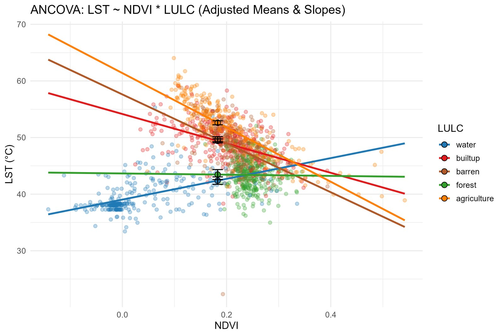
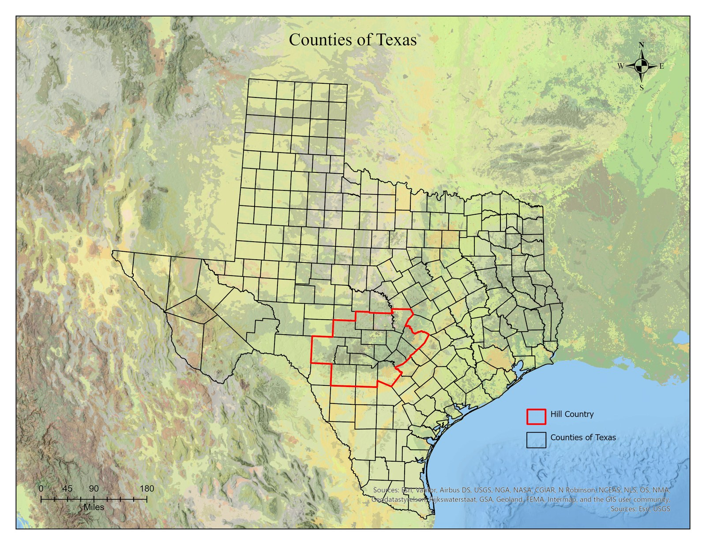
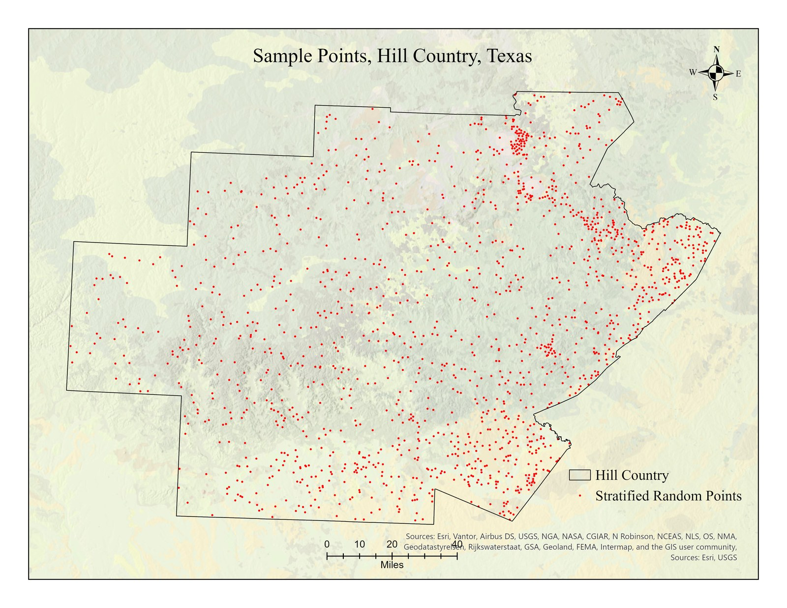
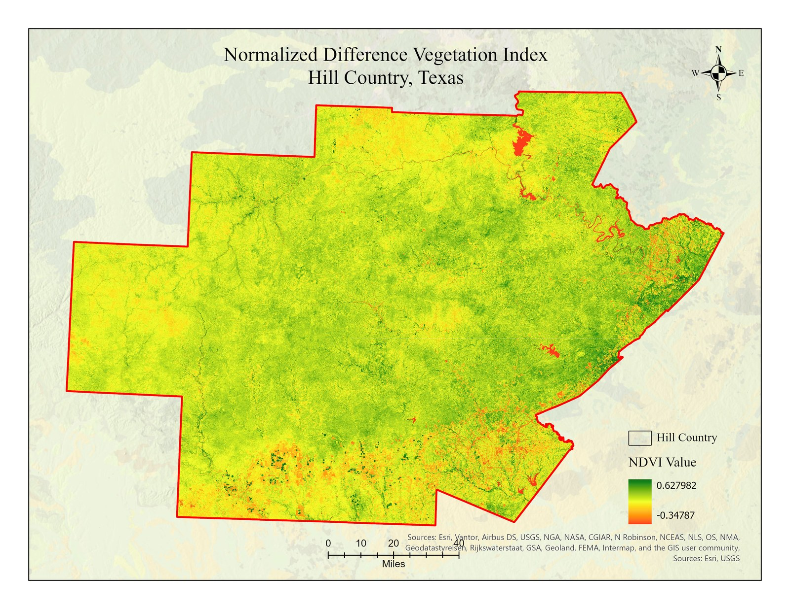
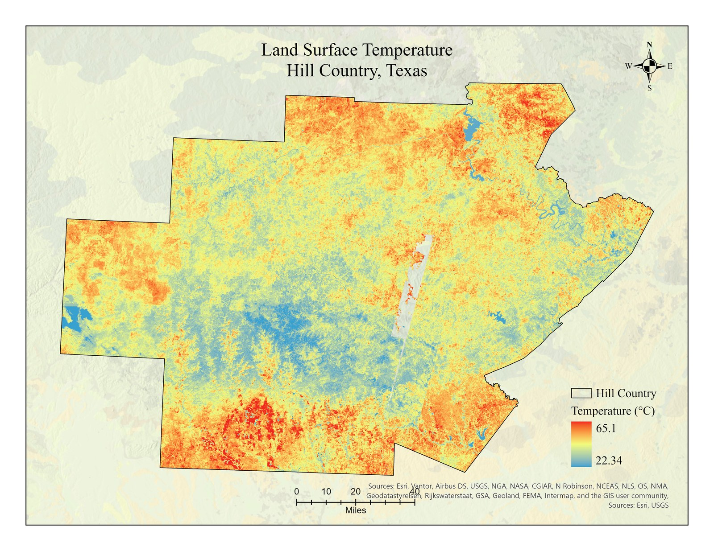
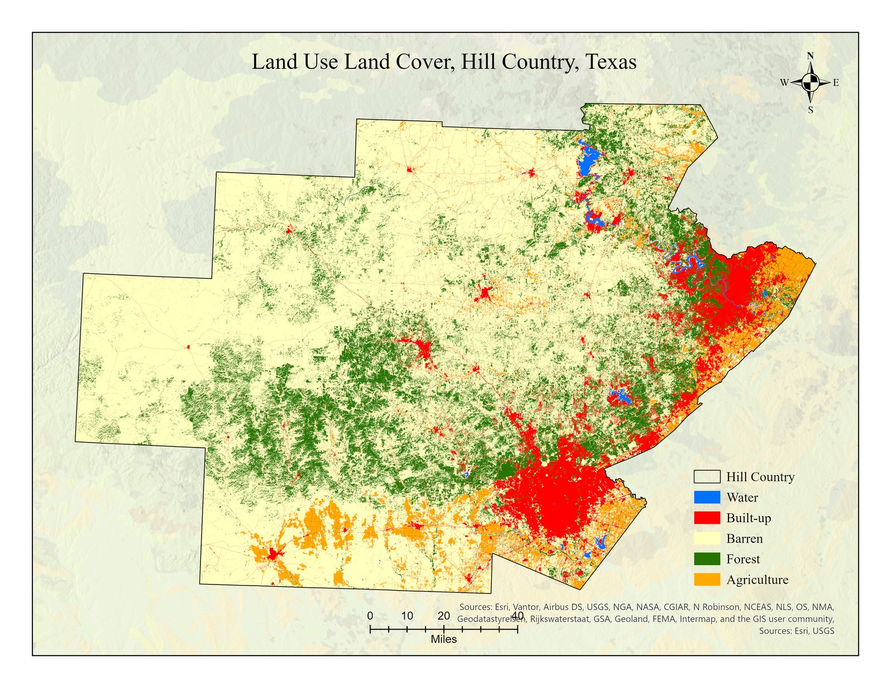
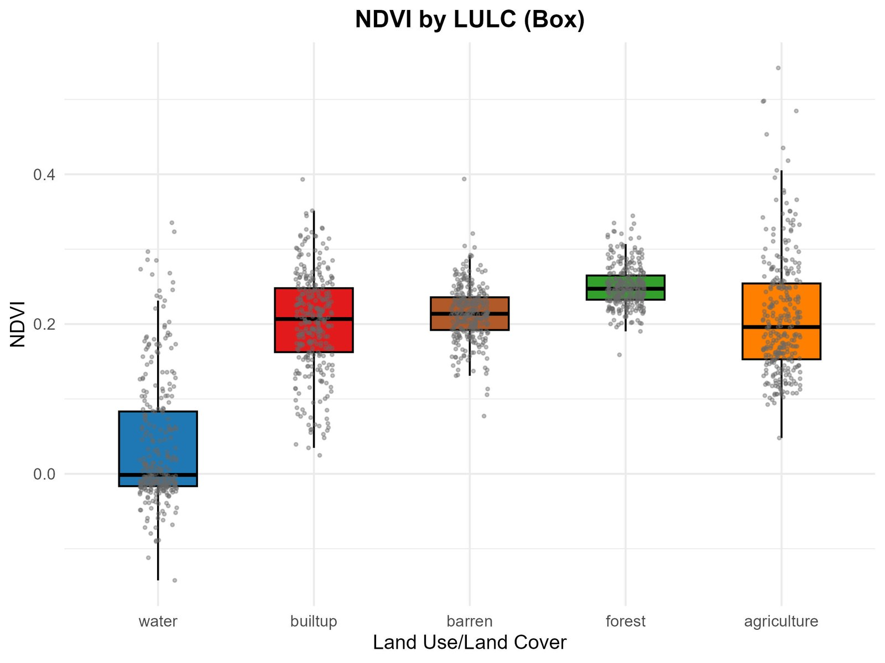
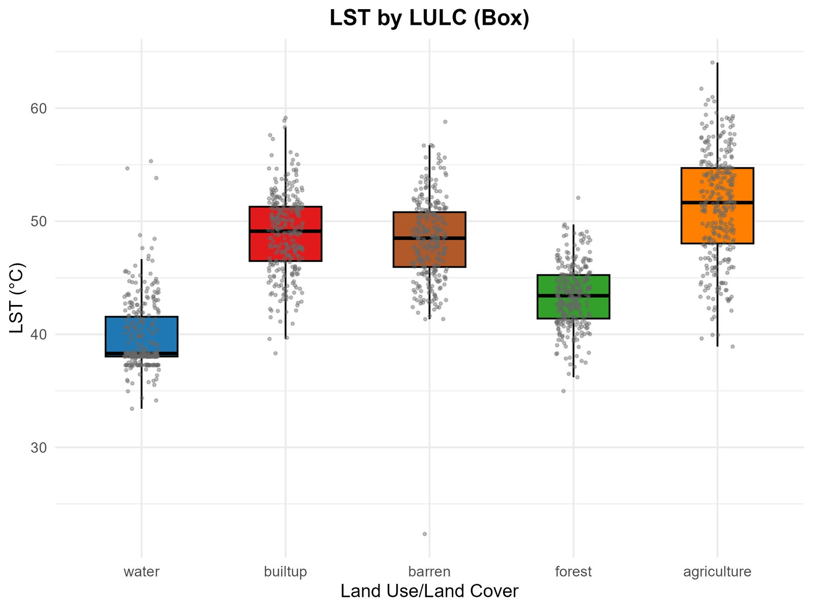
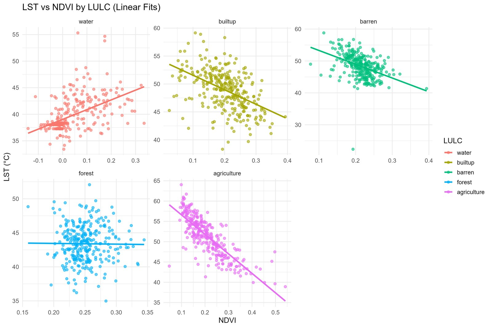

# NDVI, Land Surface Temperature & Land Cover — Statistical Analysis (Texas Hill Country)

A **statistics-driven remote sensing study** testing how vegetation (NDVI) relates
to **Land Surface Temperature (LST)** across five land-cover types in the Texas
Hill Country. Combines ArcGIS Pro raster processing with a complete, reproducible
**non-parametric statistical workflow in R** (Levene, Kruskal–Wallis, Dunn,
correlation, regression, ANCOVA). Full R script and result tables included.



## Problem
Different land surfaces absorb and release heat differently, so the cooling effect
of vegetation is not uniform. This study quantifies, with statistical rigor, how
the NDVI–LST relationship changes across water, forest, agriculture, built-up, and
barren land.

## Study area & data
17-county Texas Hill Country region.

| Dataset | Use | Source | Resolution |
|---|---|---|---|
| Landsat 8/9 Collection 2 ARD (Aug 19–21, 2024) | NDVI & LST | USGS EarthExplorer | 30 m |
| Annual NLCD 2024 | Land cover (LULC) | MRLC | 30 m |
| County boundaries / Hill Country extent | Study area mask | Census TIGER | — |

| Study area | Sample points |
|---|---|
|  |  |

## Methods
1. **ArcGIS Pro:** mosaic/stack Landsat bands; NDVI = (NIR−Red)/(NIR+Red) (B5/B4);
   LST from thermal band ST_B10 (metadata scaling → °C).
2. **Reclassify NLCD** into 5 classes: Urban/Built-up, Agriculture, Forest, Water, Barren.
3. **Stratified random sampling:** 300 points/class = **1,500 points**, 900 m min spacing;
   NDVI/LST extracted via Zonal Statistics → `data/StratifiedPointsTable.csv`.
4. **R workflow** (`Final_Project_Statistics.R`, packages: tidyverse, car, rstatix,
   FSA, emmeans, ggpubr): Levene's test → Kruskal–Wallis + Dunn (Bonferroni) →
   Pearson/Spearman correlation → linear regression → ANCOVA interaction.

| NDVI | LST | Land cover |
|---|---|---|
|  |  |  |

## Results

**Descriptive (mean by class):**
| LULC | Mean NDVI | Mean LST (°C) | Pearson r (NDVI–LST) |
|---|---|---|---|
| Water | 0.038 | 39.73 | +0.50 |
| Forest | 0.251 | 43.39 | −0.01 (ns) |
| Agriculture | 0.210 | 51.31 | **−0.80** |
| Built-up | 0.203 | 48.89 | −0.48 |
| Barren | 0.214 | 48.36 | −0.43 |

- **Kruskal–Wallis:** classes differ significantly for both NDVI and LST (p < 0.001).
- **Dunn post-hoc:** NDVI — Forest > Agriculture ≈ Barren ≈ Built-up > Water;
  LST — Agriculture > Built-up ≈ Barren > Forest > Water.
- **Regression slopes (°C per NDVI unit):** Agriculture −47.98 (R² 0.64),
  Barren −43.19, Built-up −25.97, Forest −1.07 (ns). Full model:
  **LST = 43.8 + 13.85·NDVI** (R² 0.06, p < 0.001).
- **ANCOVA:** significant **NDVI × land-cover interaction** — vegetation strongly
  cools agriculture, built-up, and barren land, but has almost no effect in forest.

| NDVI by class | LST by class | LST vs NDVI per class |
|---|---|---|
|  |  |  |

All result tables are in [`outputs/`](outputs/): descriptive summary, Dunn post-hoc
(NDVI & LST), correlations, per-class and overall regression, and ANCOVA slopes.

## Reproduce
```r
# from the repo root, with data/StratifiedPointsTable.csv present
source("Final_Project_Statistics.R")   # writes tables/plots to outputs/
```

## Tools & skills demonstrated
ArcGIS Pro (raster processing, band math, Zonal Statistics, stratified sampling) ·
Landsat NDVI/LST derivation · **R** (tidyverse, car, rstatix, FSA, emmeans) ·
non-parametric hypothesis testing · correlation · regression · **ANCOVA /
interaction analysis** · reproducible scripting · scientific data visualization.

## Limitations
NLCD land cover from a separate source (possible label mismatch); NDVI not
meaningful over water; NDVI saturation in dense forest; single-date (Aug 2024)
snapshot; 30 m resolution; 5 broad classes.

## Author
**Nirajan Tripathi** — M.S. Geography, Texas State University
[Portfolio](https://nirajan550123.github.io/) ·
[LinkedIn](https://www.linkedin.com/in/nirajan-tripathi-5434a8308/) ·
[GitHub](https://github.com/nirajan550123)
