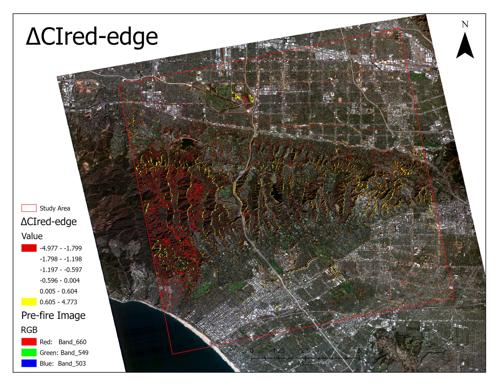
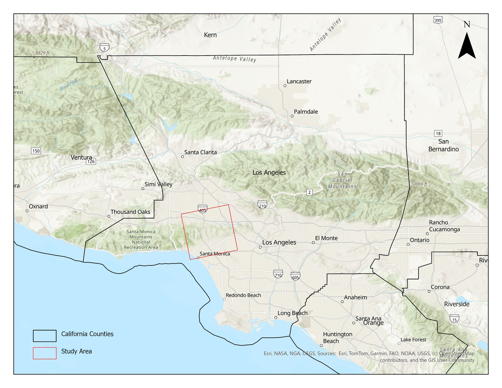
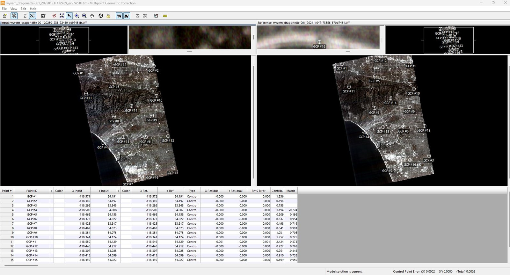
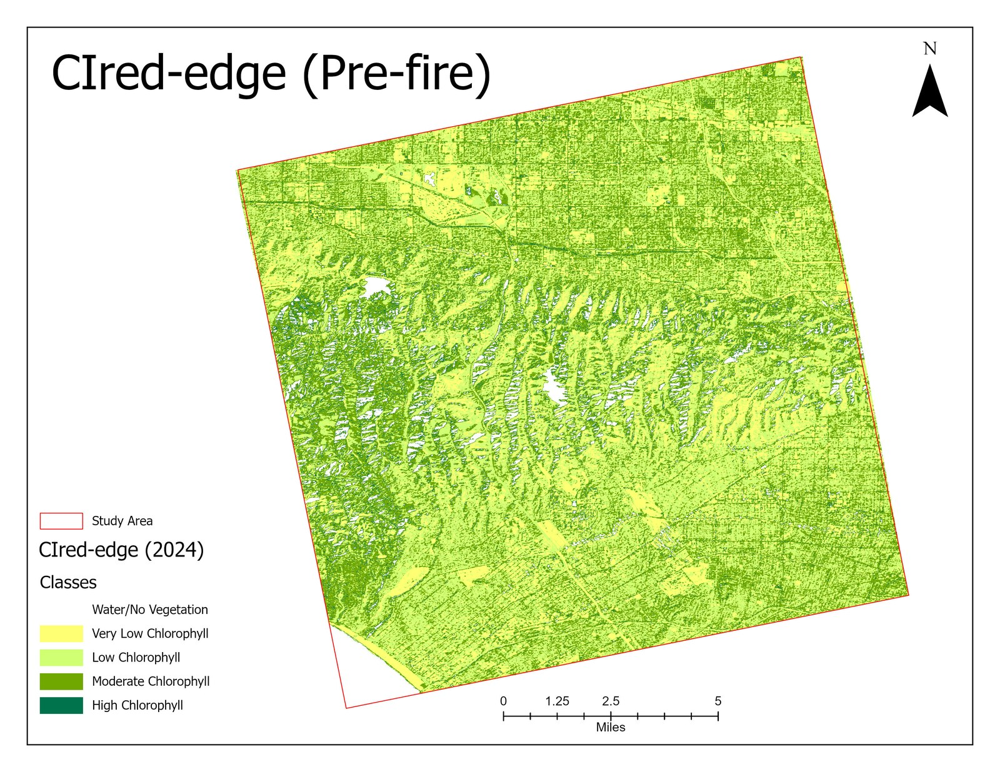
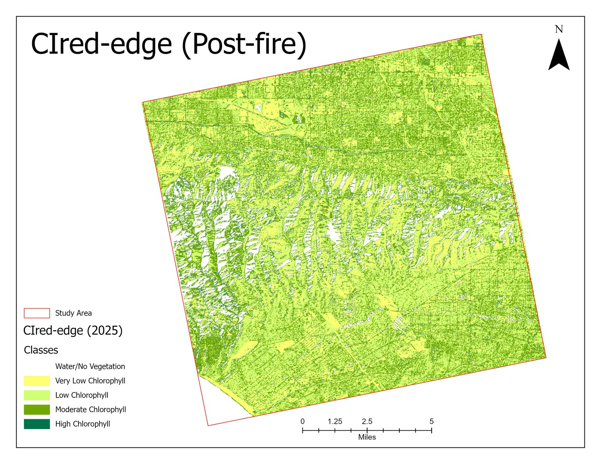
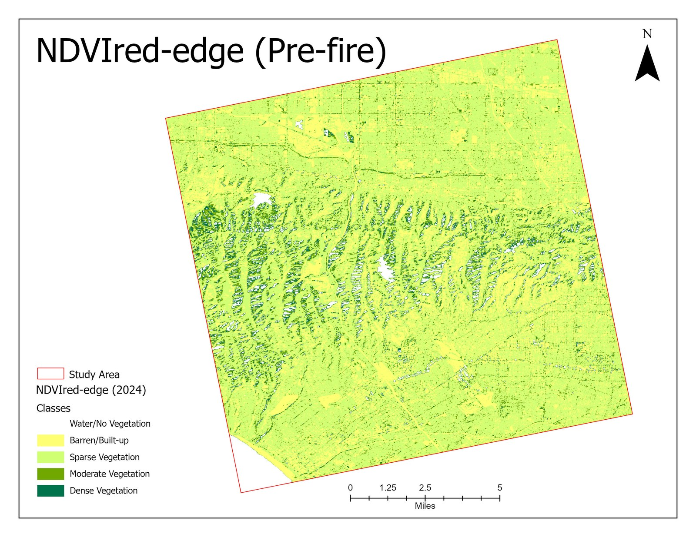
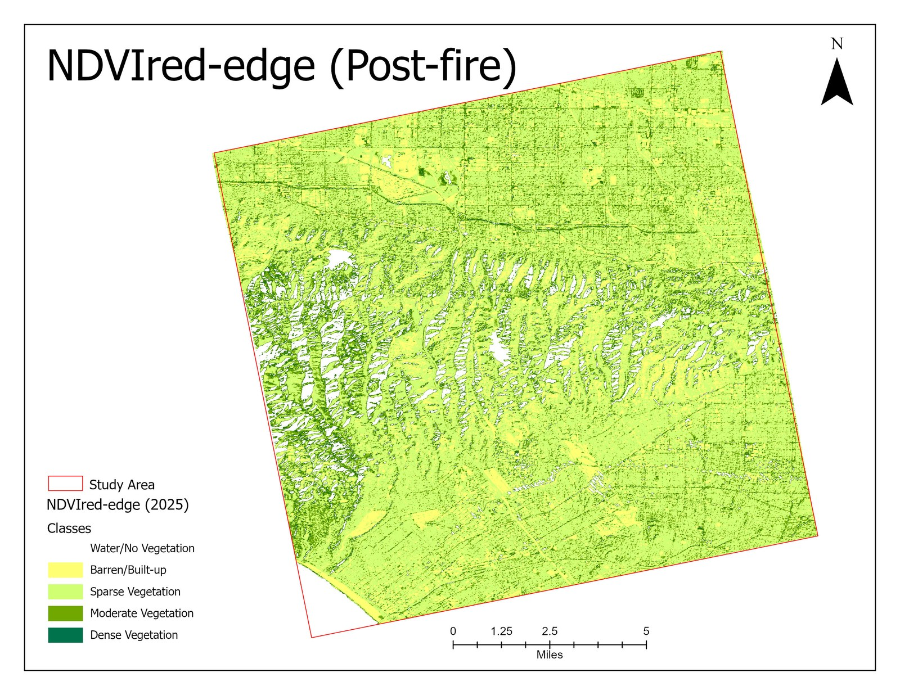

# Post-Fire Vegetation Damage Assessment — 2025 Pacific Palisades Fire

Pre/post-fire **change detection using VNIR hyperspectral satellite imagery**
(Wyvern Dragonette-001) to map vegetation loss and burn severity from the
**January 7, 2025 Palisades Fire** in Los Angeles County, California. Red-edge
chlorophyll and NDVI indices are differenced across dates to quantify where
vegetation was damaged.

## Problem
The Palisades Fire struck a coastal chaparral **wildland–urban interface** with
steep terrain, damaging vegetation and infrastructure. Fast, reliable maps of
where vegetation was lost support burn-severity assessment, recovery monitoring,
and future fire-risk planning.

## Study area
Pacific Palisades / Santa Monica Mountains, Los Angeles County, CA — a mix of
dense shrubland, grassland, and urban development.

## Data
| Item | Detail |
|------|--------|
| Sensor | **Wyvern Dragonette-001** (commercial VNIR hyperspectral, LEO) |
| Spatial resolution | 5.3 m GSD |
| Spectral | 23 narrow VNIR bands, 500–800 nm, 12-bit |
| Pre-fire image | 04 Nov 2024 |
| Post-fire image | 23 Jan 2025 |
| Delivered as | Geometrically corrected radiance, EPSG:4326 |

Bands used: **red-edge band 20 (~750 nm)** and **NIR band 23 (~799 nm)** — chosen
because the red-edge transition is highly sensitive to canopy structure and
chlorophyll, making it effective for detecting subtle post-fire stress.

## Methodology
1. **Visual co-registration check** of pre/post imagery; multipoint **geometric
   correction** (total control-point RMS error **0.0002**).
2. Select red-edge (b20) and NIR (b23) bands.
3. Convert radiance → **TOA reflectance** using image metadata (reduces volume,
   standardizes comparison).
4. **Stack** selected bands and **re-project** WGS84 → WGS 1984 UTM Zone 11N.
5. Compute two vegetation indices for each date:
   - **CIred-edge** (Red-edge Chlorophyll Index) — chlorophyll content
   - **NDVIred-edge** — canopy greenness/structure
6. **Index differencing** (post − pre) to build ΔCIred-edge and ΔNDVIred-edge
   change maps.
7. Interpret: **negative Δ = vegetation loss / higher burn severity**;
   near-zero/positive Δ = unburned or regrowth.

## Results
**Statistics (differenced images):**
- ΔCIred-edge mean ≈ **−0.30** (range −4.98 to 4.77)
- ΔNDVIred-edge mean ≈ **−0.07** (range −1.98 to 0.90)

**Findings:**
- Strong vegetation loss concentrated in **forested / vegetation-dominated
  hilltops** — high burn severity linked to dense fuel and vegetation continuity.
- **Urban / built-up areas showed little to no reduction**, reflecting low
  vegetation density and fire-resistant surfaces.
- Both indices agreed spatially: CIred-edge captured **chlorophyll loss**,
  NDVIred-edge captured **structural canopy loss**, confirming the change pattern.

### Pre vs. post-fire chlorophyll (CIred-edge)
| Pre-fire (Nov 2024) | Post-fire (Jan 2025) |
|---|---|
|  |  |

### Pre vs. post-fire greenness (NDVIred-edge)
| Pre-fire (Nov 2024) | Post-fire (Jan 2025) |
|---|---|
|  |  |

## Tools & skills demonstrated
ERDAS IMAGINE · hyperspectral (VNIR) processing · band extraction & layer
stacking · radiance→reflectance (TOA) conversion · geometric & radiometric
correction · re-projection (UTM) · red-edge vegetation indices (CIred-edge,
NDVIred-edge) · multi-temporal change detection · burn-severity interpretation ·
cartographic output (ArcGIS Pro).

## Limitations & next steps
- Index thresholds for severity classes could be calibrated against field or
  dNBR reference data.
- Add atmospheric correction (surface reflectance) for cross-sensor robustness.
- Validate against an independent burn-perimeter dataset.

## Author
**Nirajan Tripathi** — M.S. Geography, Texas State University
[Portfolio](https://nirajan550123.github.io/) ·
[LinkedIn](https://www.linkedin.com/in/nirajan-tripathi-5434a8308/) ·
[GitHub](https://github.com/nirajan550123)

*Graduate remote sensing course project, Fall 2025.*
