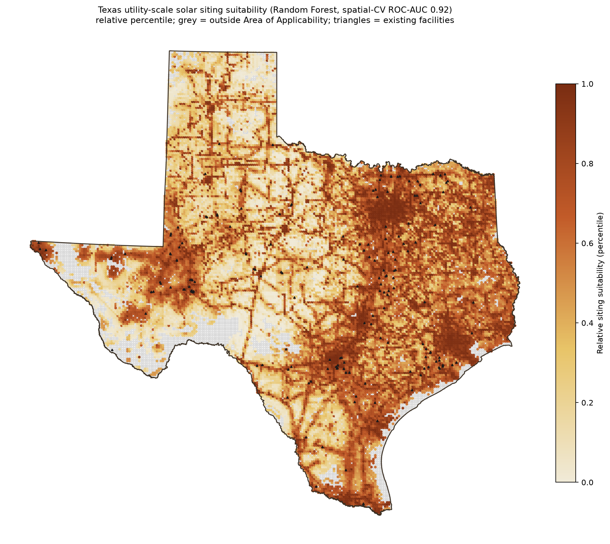

# Where Solar Gets Built (and Why It Isn't About Sun)

**A machine-learning analysis of utility-scale solar siting in Texas, with a North Carolina transfer test.**

Developers do not build solar farms where the sun is strongest. They build where the grid is reachable. This project shows that, quantifies it, and then demonstrates the rule is regime-specific by transferring the model to a state with the opposite policy environment.

---

## The headline

Using 176 operating utility-scale solar facilities across Texas, a Random Forest model trained on land, terrain, irradiance, and grid-access features finds:

- **Distance to transmission infrastructure is roughly an order of magnitude more important than solar irradiance** for predicting where solar actually gets sited (permutation importance ~9x; SHAP ~5x).
- **Irradiance is a real but minor predictor.** Across Texas's uniformly sunny range (4.5 to 5.87 kWh/m²/day), the marginal sunshine difference between one parcel and the next barely moves siting decisions.
- The model discriminates sited from unsited land at **spatial cross-validated ROC-AUC 0.92**, and that performance holds up under demanding spatial validation (more on that below).

Then the part that makes it more than a Texas story:

- **North Carolina built about four times as much solar as Texas despite lower irradiance.** Worse sun, more solar. Policy beats physics.
- The Texas-trained model transfers to North Carolina at **ROC-AUC 0.76 ± 0.01**, partial transfer. The siting logic generalizes in kind (grid access matters everywhere) but shifts in degree (what counts as "close enough" to the grid is set by each state's regulatory regime).



*Relative siting suitability across Texas. Warm corridors trace grid-accessible east and central Texas; grey areas fall outside the model's Area of Applicability. Triangles are existing facilities, which land overwhelmingly in the warm zones.*

---

## Why this is interesting

Most solar-potential maps rank land by sunshine and slope. They describe *physical potential*. This project models *realized siting*: where developers actually chose to build, which turns out to be a different and more economically revealing question. The gap between the two, irradiance barely matters, grid access dominates, is the contribution.

The transfer test sharpens it. Comparable siting studies rarely test whether their model generalizes to another state at all. By training on Texas and predicting North Carolina, this project shows the siting relationship is universal in shape but regime-specific in calibration, and it localizes exactly where generalization breaks: at the state and policy boundary, not within a state.

---

## What's in the repo

| Area | What it contains |
|------|------------------|
| `src/` | Numbered pipeline scripts, data pull through modeling, validation, figures, and every robustness check |
| `data/` | Processed model tables and boundaries (raw pulls are gitignored; see Setup) |
| `outputs/figures/` | Eight publication-quality figures (suitability map, SHAP, transfer, AOA support) |
| `docs/decisions_log.md` | A dated record of every methodological choice and its rationale, with citations |

---

## How it was built

**Problem framing.** Verified solar facilities give *presences* only; there is no such thing as a confirmed "never-solar" parcel. So the project borrows presence-background methodology from species distribution modeling (Barbet-Massin et al., 2012): real facilities versus pseudo-absences drawn from developable land, with 10 balanced replicate draws averaged for stability.

**Features.** Each facility is summarized over its actual footprint, not a single centroid point, so a 500 MW plant is represented by the land it really occupies (a change-of-support correction; Gotway & Young, 2002). Features span solar irradiance (NREL/NSRDB), slope and elevation (USGS 3DEP), land cover (NLCD), and distance to transmission lines, substations, and roads (HIFLD, TIGER).

**Developable-land mask.** Slope above 5% grade, water, wetlands, forest, and high-intensity development are excluded, following NREL and peer-reviewed siting conventions (Lopez et al., 2012; Hernandez et al., 2015).

**Models.** Random Forest (headline) and XGBoost, against a logistic-regression baseline. RF and XGBoost tie near ROC 0.92; logistic trails at 0.85, so the tree models earn their complexity.

**Validation is where this project goes beyond the typical siting paper.** Siting features are spatially autocorrelated, and naive random cross-validation leaks that structure and inflates scores (Roberts et al., 2017; Ploton et al., 2020). This project reports a full validation ladder instead of a single optimistic number:

| Validation | ROC-AUC | What it tests |
|------------|--------:|---------------|
| Random CV | ~0.93 | Interpolation (optimistic baseline) |
| Spatial block CV (130 km) | 0.92 | Spatial independence |
| Leave-one-region-out (EPA ecoregions) | 0.91 | Extrapolation to unseen Texas regions |
| Transfer to North Carolina | 0.76 | Cross-state, cross-regime extrapolation |

The smooth decline tells the story: the model generalizes well *within* Texas (the small block-CV gap is real, not an artifact of loose validation), and the large drop appears only when crossing into a different policy and grid regime. Block size was set from the data's own 12 km residual autocorrelation range, not guessed.

---

## Robustness: the hard questions, answered

Rather than report one clean result, the project stress-tests the things a skeptical reviewer would attack. Each check is documented with its method and citations in `docs/decisions_log.md`.

- **"Distance-to-transmission is circular, operating farms are wired to transmission by definition."** Bounded directly. With every grid feature removed and only interconnection-immune features left (irradiance, slope, elevation, land cover), the model still discriminates at ROC 0.72. About two-thirds of the signal survives, so grid access *amplifies* a real pre-existing siting signal rather than being a measurement artifact. (Pre-construction grid data is restricted under post-9/11 CEII rules, so this sensitivity bound plus honest disclosure is the defensible path; Bellemare et al., 2017.)
- **"Irradiance only looks unimportant because it's coarsely resolved."** The opposite is true. The fair (permutation) importance metric does not penalize low-resolution features, and irradiance still ranks far below grid access. A Boruta shadow-feature test confirms irradiance *is* a genuine predictor, just a minor one.
- **"Your importance ranking might be a single lucky run."** Across 10 replicate draws, transmission is the top feature in all 10 and substation second in all 10; the error bars don't overlap the lower features.
- **"The suitability map claims applicability it doesn't have."** The Area of Applicability (94.8% of Texas) was validated with local data-point density: 86% of in-domain cells rest on 10 or more supporting training points, not isolated near-duplicates (Meyer & Pebesma, 2021; Schumacher et al., 2025).
- **"The transfer result could be a single-draw fluke."** Stable at 0.76 ± 0.01 across 10 North Carolina pseudo-absence draws.

---

## Honest limitations

Kept here because the work is more credible for stating them plainly.

- **Single training state and a modest sample (176 facilities).** Texas is large and solar-dense enough for spatial blocking, but it is one regime. The North Carolina transfer probes generalization; it does not replace multi-state training.
- **The "irradiance is minor" claim is Texas-specific.** Within Texas's narrow, uniformly high irradiance range there is little gradient for siting to track. This is a statement about realized siting in a sunny state, not a claim that irradiance is physically irrelevant everywhere.
- **Suitability outputs are relative percentiles, not calibrated probabilities.** Presence-background models recover relative suitability and discrimination, not absolute probability of development (Guillera-Arroita et al., 2015). The map is honest about ranking, not about literal build probability.
- **The panhandle (High Plains) is where the model extrapolates least well** (leave-one-region-out AUC 0.86, lower Boyce), reported transparently rather than smoothed over.

---

## Setup

```bash
# Python 3.11
python -m venv .venv && source .venv/bin/activate   # Windows: .venv\Scripts\Activate.ps1
pip install -r requirements-lock.txt
```

This project pulls irradiance from the NREL developer API. You will need your own free key from https://developer.nrel.gov/, placed in a local `.env` file as `NREL_API_KEY=your_key_here`. The `.env` file is gitignored and must never be committed. Earth Engine access requires a Google Earth Engine account and a one-time `earthengine authenticate`.

Scripts in `src/` are numbered in execution order. The decisions log in `docs/` explains what each stage does and why.

---

## Selected references

Barbet-Massin, M., Jiguet, F., Albert, C. H., & Thuiller, W. (2012). Selecting pseudo-absences for species distribution models: How, where and how many? *Methods in Ecology and Evolution, 3*(2), 327-338.

Guillera-Arroita, G., Lahoz-Monfort, J. J., Elith, J., et al. (2015). Is my species distribution model fit for purpose? Matching data and models to applications. *Global Ecology and Biogeography, 24*(3), 276-292.

Hernandez, R. R., Hoffacker, M. K., Murphy-Mariscal, M. L., et al. (2015). Solar energy development impacts on land cover change and protected areas. *PNAS, 112*(44), 13579-13584.

Meyer, H., & Pebesma, E. (2021). Predicting into unknown space? Estimating the area of applicability of spatial prediction models. *Methods in Ecology and Evolution, 12*(9), 1620-1633.

Roberts, D. R., Bahn, V., Ciuti, S., et al. (2017). Cross-validation strategies for data with temporal, spatial, hierarchical, or phylogenetic structure. *Ecography, 40*(8), 913-929.

Wu, G. C., Min, Y., Deshmukh, R., et al. (2026). Factors shaping the siting of utility-scale solar and wind projects in the United States. *Environmental Research Letters, 21*(9), 094003.

Full citation list and methodological rationale in `docs/decisions_log.md`.

---

*Built with Python, scikit-learn, GeoPandas, Google Earth Engine, and SHAP. Author: Nirajan. M.S. Geography (GIS and remote sensing), Texas State University.*
