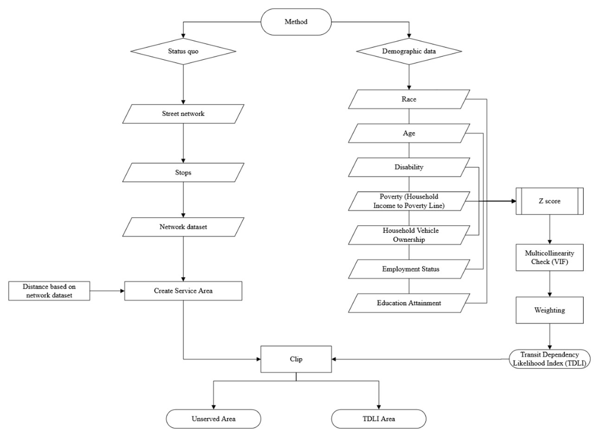

# Transit Dependency Likelihood Index (TDLI) — Portland, Oregon

A custom **ArcGIS Python (ArcPy) tool** that combines demographic need with real
transit service coverage to find neighborhoods that are highly transit-dependent
**but** poorly served by existing bus stops. Built as a reusable, parameterized
geoprocessing tool so the same workflow can be re-run for any city.

## Problem
Portland has a strong transit system overall, yet service is not evenly
distributed. Some neighborhoods with the highest dependence on public transit
still fall outside the walking-distance service area of any bus stop. This tool
quantifies that mismatch and outputs the specific street segments where the gap
is worst, so planners can target investment.

## What the tool does
1. Reads a polygon layer (census geography) and user-selected demographic fields.
2. Standardizes each variable with **z-scores**, then reclassifies into weighted
   scores (W = 0, 0.5, 1).
3. Computes a weighted **Transit Dependency Index (TDI)** per polygon (equal or
   custom weights).
4. Runs a **multicollinearity (VIF)** check on the selected variables.
5. Builds **Network Analyst service areas** around bus stops at a chosen
   walking-distance threshold.
6. Uses a **symmetric difference + clip** overlay to isolate high-TDI areas that
   lie outside transit coverage, and clips the street network to output the
   **unserved street segments**.

## Inputs (tool parameters)
| # | Parameter | Example |
|---|-----------|---------|
| 0 | Input polygon feature class | Census tracts/blocks |
| 1 | Bus stop feature class | TriMet stops |
| 2 | Service-area distance | 800 ft |
| 3 | Street network | OSM / city streets |
| 4 | Network dataset | for service areas |
| 5 | Demographic fields | age 65+, poverty, minority, disability, vehicle access, education |
| 6 | Weight mode | `equal` or `custom` |
| 7 | Custom weights | `1;1;0.5;...` |
| 8 | Output: TDLI areas | |
| 9 | Output: unserved streets | |

## Data sources
- **Demographics:** U.S. Census Bureau — https://data.census.gov
- **City boundary / geography:** Census TIGER/Line — https://www.census.gov/geographies/mapping-files/time-series/geo/tiger-line-file.html
- **Transit routes & stops, streets:** Portland-area open data (GeoHub / TriMet GTFS)

## Settings used in the Portland run
- **Variables:** population 65+, poverty %, minority %, disability %, vehicle ownership, education
- **Weighting:** equal
- **Service distance:** 800 ft buffer around active transit stops
- **High-need threshold:** TDI ≥ 0.5

## Results
- High transit-dependency areas concentrate in the **northern part of the city**, and
  many fall **outside** the 800-ft service area of existing stops — a clear service gap.
- The highest-TDI area has a **disability population above 35%**.
- Areas scoring **TDI 0.50–0.54** include **~7.2% of residents in poverty** and
  **over 19% identified as disabled**, supporting the index's validity.
- Output layers: high-TDI polygons, unserved high-TDI polygons, and **unserved
  street segments** for targeted stop placement / micro-transit.

## Methodology diagram

## How to run
1. Open **ArcGIS Pro** and add `TDIandSERVICEGAP.atbx` to your project.
2. Open the **TDI and Service Gap** tool and set the parameters above.
3. Run. Outputs are written to the feature classes you specify (8 and 9).

> Requires ArcGIS Pro with the **Network Analyst** extension. Python deps used
> inside ArcGIS: `pandas`, `numpy`, `scipy`, `statsmodels`.

## Tools & skills demonstrated
ArcPy · ArcGIS Pro · Network Analyst · Python · pandas · NumPy · SciPy ·
statsmodels (VIF) · z-score standardization · weighted overlay · spatial
overlay (symmetric difference, clip) · reusable geoprocessing tool design.

## Limitations & next steps
- Single accessibility radius for all transit modes (next: mode-specific radii).
- Ignores service frequency/reliability (next: schedule-based weighting).
- Add input data-quality and CRS checks; package as a `.pyt` Python toolbox.

## Author
**Nirajan Tripathi** — M.S. Geography, Texas State University
[Portfolio](https://nirajan550123.github.io/) ·
[LinkedIn](https://www.linkedin.com/in/nirajan-tripathi-5434a8308/) ·
[GitHub](https://github.com/nirajan550123)

*Course project (GIS II, Spring 2025), co-authored with S. Salimi and B. Heidari.*
