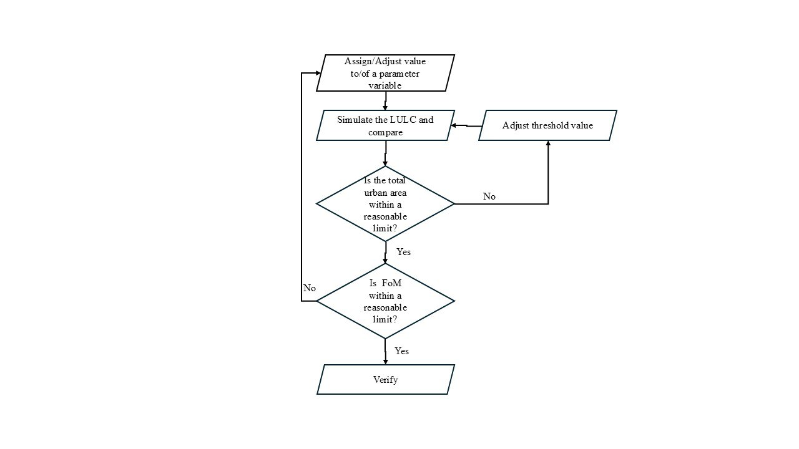
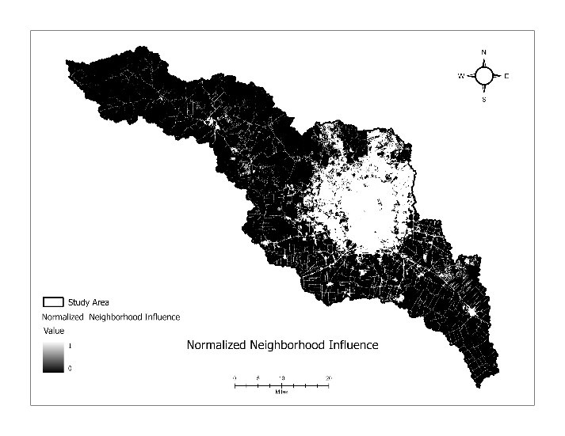
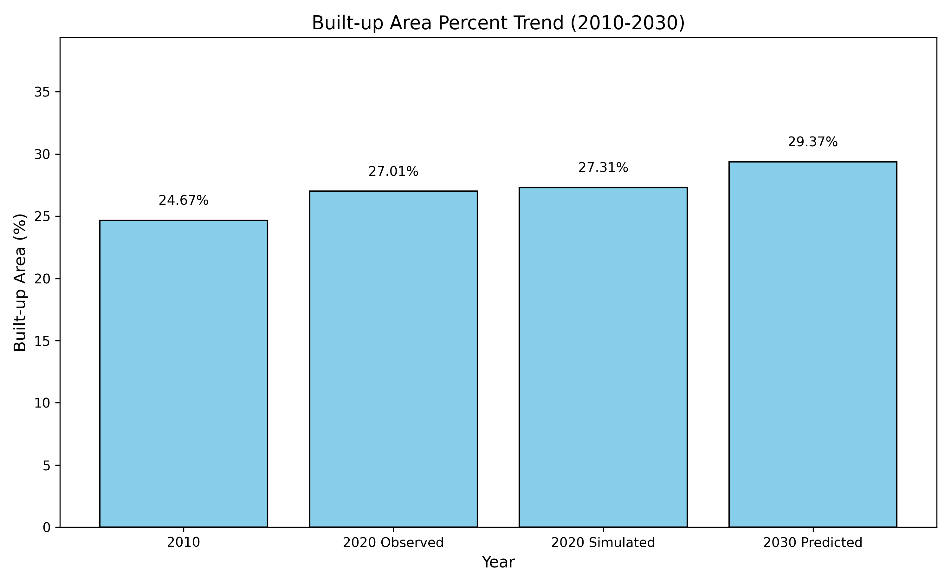

# Watershed-Based Land Cover Simulation — Markov-CA Urban Growth Model (San Antonio, TX)

A **predictive land-use change model** that simulates where a city will grow.
Using a **Markov chain–Cellular Automata (Markov-CA)** approach, this project
delineates the San Antonio River watershed, learns 2010→2020 land-cover
transitions, calibrates a spatial growth model, and **forecasts urban expansion
to 2030**. Validated against observed data with a **Figure of Merit of 0.85**.


## Problem
Urban growth reshapes watershed hydrology — more impervious surface means more
runoff, more flood risk, and less groundwater recharge. Knowing *where* a city
will expand lets planners target interventions before the change happens. This
model answers: how is San Antonio's urban area growing, and where will it be by 2030?

## Study area
Watershed of the **San Antonio River near Falls City, TX (USGS gauge 08183500)**,
delineated from a 30 m DEM — **~5,453 km²** containing the core of San Antonio.


## Data
| Dataset | Year | Source |
|---|---|---|
| DEM (watershed delineation) | static | USGS EarthExplorer |
| NLCD land cover | 2010 & 2020 | MRLC |
| Roads (highways vs. general) | static | TxDOT Open Data |
| Attractive features (universities, markets, facilities) | static | OpenStreetMap (bbbike) |

## Method
1. **Delineate watershed** from DEM (Fill → Flow Direction → Flow Accumulation →
   Snap Pour Point → Watershed).
2. **Reclassify** NLCD 2010 & 2020 into 5 classes (Water, Built, Barren, Forest, Agriculture).
3. **Markov chain:** compute the 2010→2020 transition probability matrix in **Python**.
4. **Spatial factors (CA):** normalized Euclidean distance to general roads, major
   highways, and attractive features, plus **neighborhood influence** (share of
   built cells in a 3×3 window — the strongest driver in this model).
5. **Transition potential** per cell:
   `TP = α·(Markov prob) + β1·roads + β2·highways + β3·facilities + β4·neighborhood`
6. **Transition rule:** a barren/forest/agriculture cell becomes *built* if its
   transition potential exceeds a calibrated threshold.
7. **Calibrate** weights and threshold against observed 2020 to maximize the
   **Figure of Merit**, then **simulate 2030**.

| Calibration workflow | Neighborhood influence (top driver) |
|---|---|
|  |  |

## Results
- **Calibrated model:** Figure of Merit **≈ 0.85**, false negatives ≈ 7.6%,
  false positives ≈ 6.6% — strong spatial and overall accuracy.
- **Calibrated weights:** neighborhood influence dominated (β4 = 7), then Markov
  probability (α = 5), with roads/highways/facilities each = 2; threshold = 10.5.
- **Transitions 2010→2020:** 4% of barren, 3% of agriculture, and 2% of forest
  converted to built; built areas were highly stable (>99% stay built).
- **2030 forecast:** continued growth **concentrated near the existing city core
  and along major highways**, driven mostly by neighborhood influence.

| Observed 2020 vs. predicted 2020 (validation) | Where new growth is forecast by 2030 |
|---|---|
|  |  |



### Transition probability matrix (2010→2020)
| From \ To | Water | Built | Barren | Forest | Agri |
|---|---|---|---|---|---|
| Water | 0.880 | 0.005 | 0.083 | 0.012 | 0.019 |
| Built | 0.000 | **0.994** | 0.004 | 0.001 | 0.001 |
| Barren | 0.001 | 0.041 | 0.901 | 0.045 | 0.012 |
| Forest | 0.000 | 0.022 | 0.045 | 0.932 | 0.001 |
| Agriculture | 0.000 | 0.032 | 0.087 | 0.000 | 0.880 |

| Land cover 2010 | Land cover 2020 |
|---|---|
|  |  |

## Code
Two Python scripts drive the model (in this repo):
- `markov_transition_matrix.py` — computes the 2010→2020 Markov transition count
  and probability matrices from the reclassified land-cover rasters (NumPy, rasterio).
- `calibration_figure_of_merit.py` — compares the simulated 2020 built-up map against
  observed 2020 to compute the Figure of Merit, false positives, and false negatives
  (arcpy, NumPy).

```bash
# transition matrix (standalone Python)
python markov_transition_matrix.py   # prompts for raster folder + filenames

# calibration (run inside ArcGIS Pro Python, set the .gdb raster paths first)
python calibration_figure_of_merit.py
```

## Tools & skills demonstrated
ArcGIS Pro (hydrology toolset, watershed delineation, Euclidean distance, raster
calculator, reclassification) · **Markov chain transition modeling (Python)** ·
**Cellular Automata** spatial simulation · model **calibration & validation
(Figure of Merit)** · NLCD/DEM processing · predictive land-change modeling.

## Limitations & next steps
Drivers limited to proximity and neighborhood (next: demographics, economics,
policy, climate); two-date Markov assumption of stationarity; 30 m resolution;
single watershed. Future work could add scenario-based projections.

## Author
**Nirajan Tripathi** — M.S. Geography, Texas State University
[Portfolio](https://nirajan550123.github.io/) ·
[LinkedIn](https://www.linkedin.com/in/nirajan-tripathi-5434a8308/) ·
[GitHub](https://github.com/nirajan550123)
